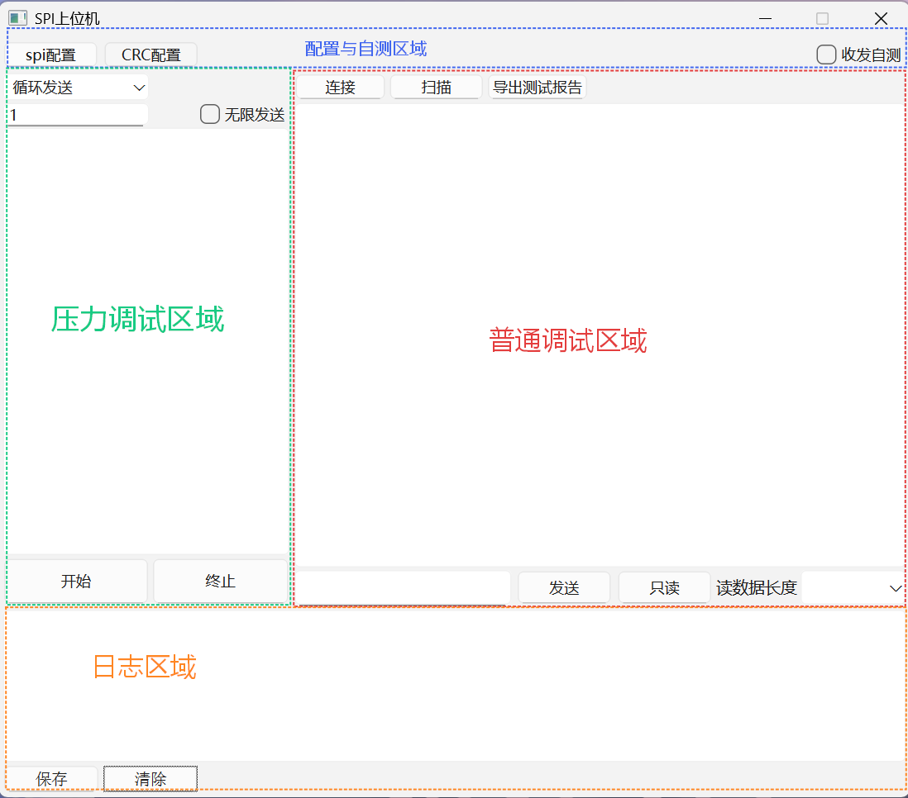
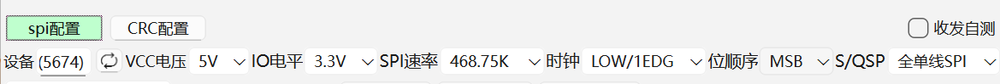
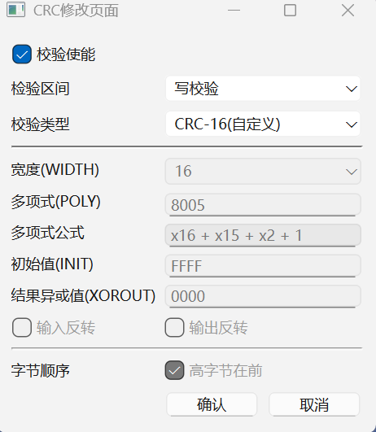
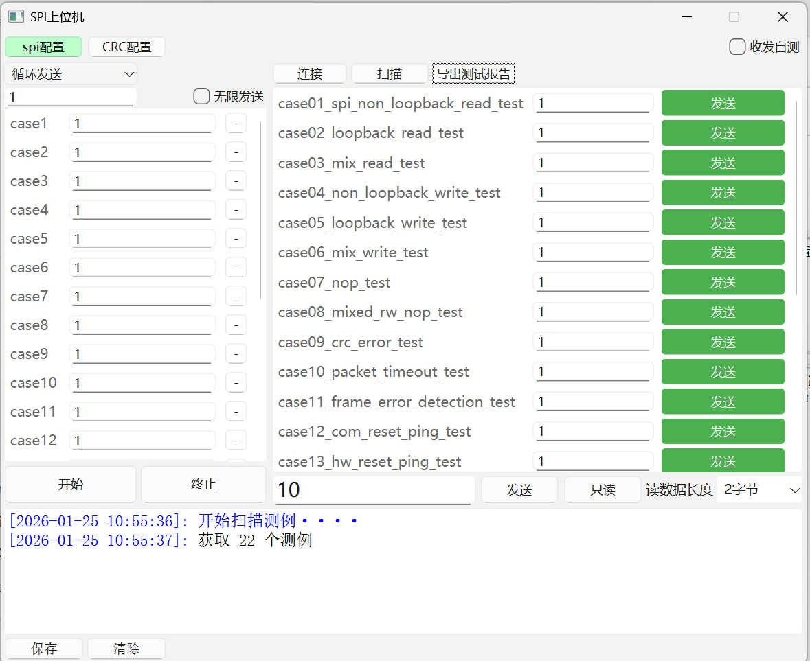
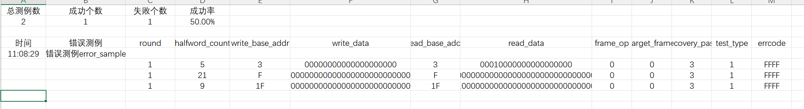
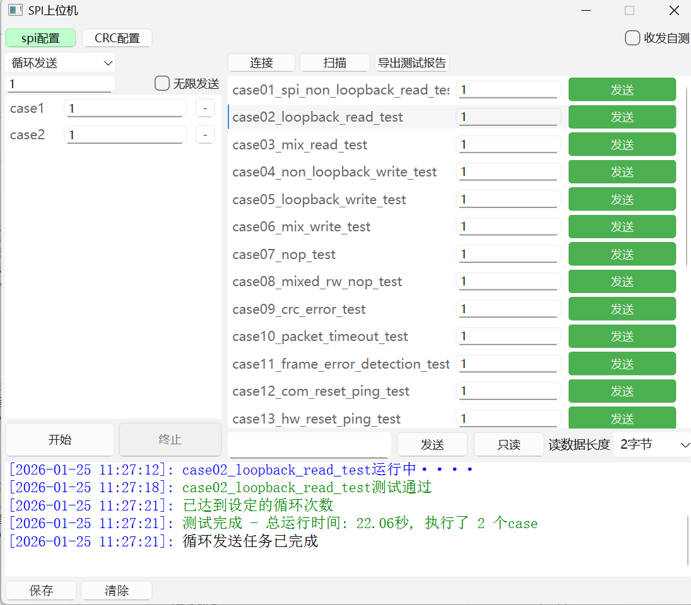
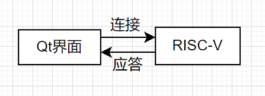
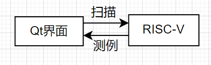

      

<b>Qt界面使用手册</b>

   

<b>项目：</b><u>测试平台Qt界面&nbsp;&nbsp;&nbsp;&nbsp;&nbsp;&nbsp;&nbsp;&nbsp;&nbsp;&nbsp;&nbsp;&nbsp;&nbsp;&nbsp;&nbsp;&nbsp;</u>

<b>版本：</b><u>V1.0&nbsp;&nbsp;&nbsp;&nbsp;&nbsp;&nbsp;&nbsp;&nbsp;&nbsp;&nbsp;&nbsp;&nbsp;&nbsp;&nbsp;&nbsp;&nbsp;&nbsp;&nbsp;&nbsp;&nbsp;&nbsp;&nbsp;&nbsp;&nbsp;&nbsp;&nbsp;&nbsp;&nbsp;&nbsp;&nbsp;&nbsp;&nbsp;&nbsp;&nbsp;&nbsp;&nbsp;</u>

<b>作者：</b><u>苏沛旭&nbsp;&nbsp;&nbsp;&nbsp;&nbsp;&nbsp;&nbsp;&nbsp;&nbsp;&nbsp;&nbsp;&nbsp;&nbsp;&nbsp;&nbsp;&nbsp;&nbsp;&nbsp;&nbsp;&nbsp;&nbsp;&nbsp;&nbsp;&nbsp;&nbsp;&nbsp;&nbsp;&nbsp;&nbsp;&nbsp;&nbsp;&nbsp;</u>

            

<b>FPGA锐智团队</b>&nbsp;&nbsp;&nbsp;&nbsp;&nbsp;&nbsp;&nbsp;&nbsp;&nbsp;&nbsp;<b>日期：</b>2026年2月9日

# 前言

本软件是测试平台配套的 Qt 上位机自动化测试工具，用户可通过此软件控制SPI模块与RISC-V之间的通信，实现对待测 FPGA 芯片的自动化测试控制。

# 1 修订记录

| 版本     | 释放日期 | 描述                        |
| -------- | -------- | --------------------------- |
| **V1.0** | 20260209 | 1. Qt界面使用手册第一次释放 |

# 2 运行环境要求

- 操作系统：支持Windows 11 64位，暂不支持Linux/macOS操作系统。
- 硬件依赖：JTool的USB转SPI模块。
- 无需安装USB驱动，启动软件即可使用，插入模块自动识别。

#  3 使用说明

软件页面可分为多个功能区，分别为配置与自测区域、压力调试区域、普通调试区域、日志区域。每个区域的功能与基本的操作逻辑将在本章节介绍。

<small><b>图3.1 主界面布局</b></small>

## 3.1 配置与自测区域

- 启动软件，插入SPI设备后，即可直接与RISC-V进行通信。如若想修改SPI设备的配置，点击**配置与自测区域**中的**spi配置**按钮，在其下方会出现spi模块的相关配置，通过下拉框可进行配置修改。

<small><b>图3.2 SPI配置区</b></small>

- 本软件发送数据时，数据自带CRC校验，点击**配置与自测区域**中的**CRC配置**按钮，在子窗口中可查看CRC校验规则

<small><b>图3.3 CRC规则界面</b></small>

-  本软件自带自测功能，需要将SPI模块的固件升级至最新版本，即可使用收发自测，流程如下：
	1. 勾选**收发自测**勾选框
	2. 使用杜邦线连接SPI模块的MISO和MOSI
	3. 在**普通调试区域**的**数据输入框**中输入数据，点击发送
	4. 在**日志区域**查看、对比发送与接收的数据

<small><b>图3.4 SPI自测示例</b></small>

## 3.2 普通调试区域

- 确保平台的连接，点击**普通调试区域**的**连接**按钮，Qt界面会向RISC-V发送通信请求。若连接成功，**日志区域**显示日志：连接成功。

<small><b>图3.5 连接成功示意</b></small>

- 与RISC-V连接成功后，点击**普通调试区域**的**扫描**按钮，Qt界面会向RISC-V发送获取测例命令。若获取成功，会在其下方显示出获取到的所有测例。

<small><b>图3.6 扫描成功示意</b></small>

- 获取测例后，在**普通调试区域**的测例里输入负载（输入为10进制数，代表测例执行的次数），点击**发送**，Qt界面会向RISC-V发送运行测例命令，RISC-V开始运行测例，直到运行结束。测例运行结果显示在**日志区域**。

<small><b>图3.7 测例运行示意</b></small>

- 测试结束后，点击**普通调试区域**的**导出测试报告**，导出csv文件。文件内包括RISC-V返回的错误日志等。报告内容保留返回的错误信息。

<small><b>图3.8 导出测试报告示意</b></small>

- **普通调试区域**内置**手动调试区域**，可以手动进行读、写调试

<small><b>图3.9 手动调试区域</b></small>

## 3.3 压力调试区域

- 每次扫描测例时，**压力调试区域**也会同步添加测例，点击case右侧的，可以删除特定的测例。
- **普通调试区域**可以将测例拖拽，放置至**压力调试区域**
- 点击**开始**按钮，启动压力测试，点击**终止**按钮，停止发送
- **压力调试区域**支持循环发送和随机发送功能，可通过**下拉框**修改发送模式。**输入框**控制循环/随机次数。如输入“1”，表示循环1轮/随机1次。

- 勾选**无限发送**勾选框，启动无限发送模式，一直发送直到用户手动点击**终止**按钮，停止发送。

- 测试结束后**日志区域**显示测试时间、执行个数。

<small><b>图3.10 压力调试示意</b></small>

## 3.4 日志区域

- **日志区域**显示连接信息、运行情况等
- 点击**保存**按钮可导出日志信息，点击**清除**按钮可清空日志信息

# 4 界面与RISC-V通信流程

- 连接流程

<small><b>图4.1 连接流程</b></small>

- 扫描流程

<small><b>图4.2 扫描流程</b></small>

- 运行测例流程

<small><b>图4.3 运行测例流程</b></small>

# 5 典型测试流程

1. 插入SPI设备，确认连接。
2. 点击**连接**按钮，连接RISC-V。
3. 连接成功后，点击**扫描**按钮，扫描RISC-V中的测例。
4. 运行测例。
5. 点击**导出测试文档**按钮，导出测试文档，分析本次测试结果。
