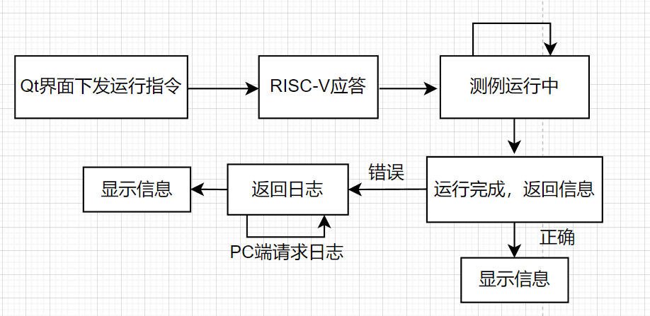

      

<b>Qt界面软件文档</b>

   

<b>项目：</b><u>测试平台Qt界面&nbsp;&nbsp;&nbsp;&nbsp;&nbsp;&nbsp;&nbsp;&nbsp;&nbsp;&nbsp;&nbsp;&nbsp;&nbsp;&nbsp;&nbsp;&nbsp;</u>

<b>版本：</b><u>V1.0&nbsp;&nbsp;&nbsp;&nbsp;&nbsp;&nbsp;&nbsp;&nbsp;&nbsp;&nbsp;&nbsp;&nbsp;&nbsp;&nbsp;&nbsp;&nbsp;&nbsp;&nbsp;&nbsp;&nbsp;&nbsp;&nbsp;&nbsp;&nbsp;&nbsp;&nbsp;&nbsp;&nbsp;&nbsp;&nbsp;&nbsp;&nbsp;&nbsp;&nbsp;&nbsp;&nbsp;</u>

<b>作者：</b><u>苏沛旭&nbsp;&nbsp;&nbsp;&nbsp;&nbsp;&nbsp;&nbsp;&nbsp;&nbsp;&nbsp;&nbsp;&nbsp;&nbsp;&nbsp;&nbsp;&nbsp;&nbsp;&nbsp;&nbsp;&nbsp;&nbsp;&nbsp;&nbsp;&nbsp;&nbsp;&nbsp;&nbsp;&nbsp;&nbsp;&nbsp;&nbsp;&nbsp;</u>

            

<b>FPGA锐智团队</b>&nbsp;&nbsp;&nbsp;&nbsp;&nbsp;&nbsp;&nbsp;&nbsp;&nbsp;&nbsp;<b>日期：</b>2026年2月9日

# 1 修订记录

| 版本     | 释放日期 | 描述                        |
| -------- | -------- | --------------------------- |
| **V1.0** | 20260209 | 1. Qt界面软件文档第一次释放 |

# 2 核心模块说明

## 2.1 主应用层 

**main.py**: 应用程序入口点，负责启动Qt应用并显示主窗口

**applicaton.py**: 主应用窗口控制器，协调各子系统，包括SPI控制器、日志系统、RISC-V调试窗口等

## 2.2 RISC-V调试核心 

**risc_v_window.py**: RISC-V调试主窗口，处理UI连接和逻辑，包含设备扫描、测例管理、循环发送等功能

**risc_v_case.py**: 测试用例执行管理，包括CaseExecution类处理单个测例的执行和结果解析

**send_controller.py**: 发送控制器，管理测试用例的批量执行，支持循环和随机发送模式

**scan_device.py**: 设备扫描功能，发现并连接SPI设备

**case_manager.py**: 测试用例管理，包括测例ID管理、控件管理等

**frame.py**: 定义通信协议帧格式和命令类型

## 2.3 SPI通信层 

**spi_driver.py**: SPI底层驱动接口，封装硬件驱动库(jtool.dll)的调用

**spi_controller.py**: SPI控制器，处理SPI通信逻辑

**spi_window.py**: SPI窗口管理，提供SPI配置界面

## 2.4 日志系统 

**log_window.py**: 日志窗口，负责日志的显示、保存、导出等功能

**log_manager.py**: 日志解析和报告生成，解析测试结果并生成CSV报告

## 2.5 子窗口系统

**sub_window.py**: 子窗口基类，提供通用子窗口功能

**sub_crc.py**: CRC配置子窗口，用于配置CRC校验参数

## 2.6 UI界面

**Ui_application.py**: 自动生成的主界面UI类

**Ui_sub_crc.py**: 自动生成的CRC配置界面UI类

## 2.7 工具模块

**crc_manager.py**: CRC计算管理，提供CRC校验功能

**crc_window.py**: CRC窗口界面

# 3 详细设计

## 3.1 主要类结构

### 3.1.1 Applicaton类

- **职责**: 主应用窗口控制器，协调各个子系统
- 属性:
	- driver: SPIDriver实例
	- spi_controller: SPI控制器
	- risc_v_window: RISC-V调试窗口
	- log_window: 日志窗口
	- sub_window: 子窗口管理
- 方法:
	- **init**: 初始化所有子系统
	- closeEvent: 处理窗口关闭事件
	- crc_mode_updated: 更新CRC模式

### 3.1.2 RiscVWindow类

- **职责**: RISC-V调试主窗口，处理UI逻辑
- 属性:
	- spi_controller: SPI控制器引用
	- send_controller: 发送控制器
	- case_manager: 测试用例管理器
- 方法:
	- setup_connections: 设置UI信号连接
	- scan_device: 扫描设备
	- scan_case: 扫描测试用例
	- start_cycle_send: 开始循环发送
	- stop_cycle_send: 停止循环发送

### 3.1.3 SendController类

- **职责**: 管理测试用例的批量执行
- 属性:
	- running: 运行状态标志
	- timer: 计时器
	- case_list: 测试用例列表
- 方法:
	- start: 开始执行测试
	- execute_next_case: 执行下一个测试用例
	- send_frame_data: 发送帧数据
	- stop: 停止执行
	- show_time: 显示执行时间

### 3.1.4 CaseExecution类

- **职责**: 执行单个测试用例并处理结果
- 属性:
	- completion_callback: 完成回调函数
	- error_callback: 错误回调函数
	- retry_count: 重试计数
- 方法:
	- receive_ack_response: 处理ACK响应
	- receive_case_result: 处理测试结果
	- result_parse: 解析测试结果
	- ask_log: 请求日志
	- log_response: 处理日志响应

## 3.2 关键功能实现

### 3.2.1 循环发送功能

- **实现方式**: 使用QTimer定时器控制发送频率
- **支持模式**: 循环发送、随机发送
- **错误处理**: 当出现错误时，通过error_callback停止发送并显示错误提示
- **状态管理**: 通过running标志控制执行状态

### 3.2.2 设备扫描功能

- **实现方式**: 通过SPI协议发送扫描命令
- **异步处理**: 使用异步方式避免界面阻塞
- **结果显示**: 将扫描结果更新到UI界面

### 3.2.3 测试用例管理

- **拖拽支持**: 支持从测例列表拖拽到测试列表
- **批量操作**: 支持自动添加所有测例到测试列表
- **动态管理**: 支持动态添加和删除测试用例

# 4 界面与RISC-V通信流程

- 连接流程

<small><b>图4.1 连接流程</b></small>

- 扫描流程

<small><b>图4.2 扫描流程</b></small>

- 运行测例流程

<small><b>图4.3 运行测例流程</b></small>

# 5 使用说明

## 5.1 环境准备

- Python 3.13+
- PySide6 == 6.9.2
- PyYAML == 6.0.2

## 5.2 启动步骤

1. 安装依赖: `pip install -r requirements.txt`
2. 运行主程序: `python main.py`

## 5.3 主要功能操作

1. **设备连接**: 点击"扫描设备"按钮，选择合适的设备参数后连接
2. **测试用例管理**: 在左侧测例列表中右键刷新，拖拽测例到右侧测试列表
3. **循环发送**: 配置发送模式和间隔时间后点击"循环发送"
4. **日志查看**: 在底部日志区域查看运行状态和结果

# 6 附录

## 6.1 通信协议定义

- 详细协议定义在`core/risc_v_debug/frame.py`中

## 6.2 构建发布

- 使用`build.py`脚本可将项目打包为exe可执行文件
